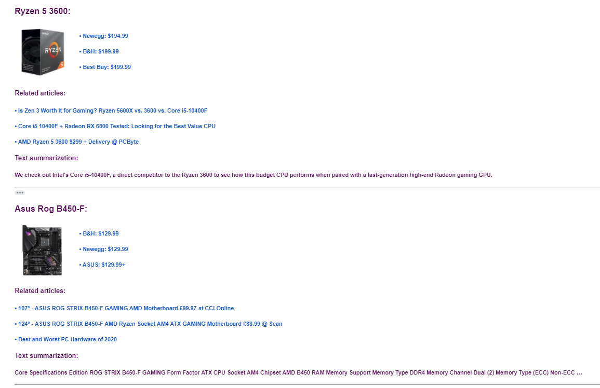

# PC_parts

## Technologies
Technologies / tools used in this project were: 

• web scraping, 

• api calling, 

• text summarization,

• mail sending


## Overview
This is a script that scrapes data from given pcpartpicker websites, it fetches related news for wanted products and does a text summarization for top news. All of this data is then sent by email or displayed in a console. 

• Script starts by parsing input file products.json. Links inside are used to scrape best prices from vendors that currently have that item in stock. Product names will be used for related news fetching.
File example:
```
[
  {
    "product_name": "Ryzen 5 3600",
    "product_link": "https://pcpartpicker.com/product/9nm323/amd-ryzen-5-3600-36-thz-6-core-processor-100-100000031box"
  },
  {
    "product_name": "Asus Rog B450-F",
    "product_link": "https://pcpartpicker.com/product/XQgzK8/asus-rog-strix-b450-f-gaming-atx-am4-motherboard-strix-b450-f-gaming"
  }
]
```

• Next part is the news fetching from https://newsapi.org/ api, where you will need to provide a apikey.json file with your own api_key. Script fetches latest related news for given product names.
File example:

```
{
  "api_key":"your_api_key"
}
```

• Last part of the script was the implementation of text summarization using NLP (Natural Language Processing). This is done by cleaning up and extracting sentences from each news description. Then we calculate number of occurrences for each word that is cleaned up, longer than 2 characters and not part of stop words. We get biggest occurrence number and devide all other occurrences by it to get frequency for each word. Sentence score is calculated by adding word frequency if word is present in the sentence. Sentence with biggest score is the text summarization.

• All of this data is stored in a dictionary and is then displayed in a console or sent by mail.
If user chooses to get this data by mail, he/she needs to provide email.json file that looks like this:
```
{
  "sender": "example_sender@gmail.com",
  "receiver": "example_receiver@gmail.com",
  "sender_pass": "password"
}
```
Data is then formated and sent by email using smtplib library. Screenshot provided below..

## Screenshots


## Time invested
This project took around 4 hours of consistent work to be completed.


## Non-commercial use
This script is my personal project and it does not have direct or indirect income-generating use. It will not be marketed or sold.

## Links
* [GitHub](https://github.com/jerinic-dusan)
* [Facebook](https://www.facebook.com/dusan.jerinic.7/)
* [Instagram](https://www.instagram.com/jerinic_/)
